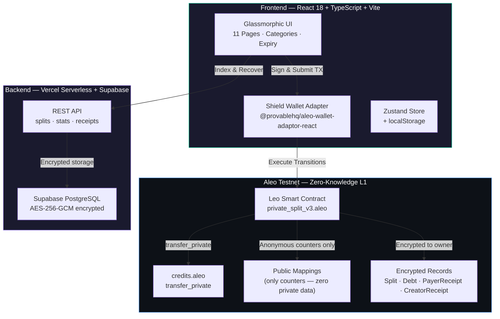
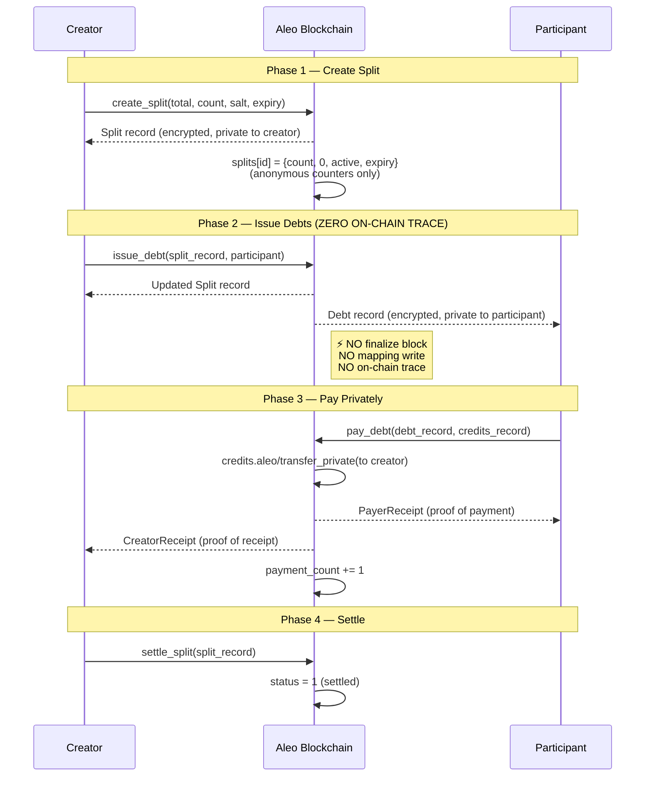
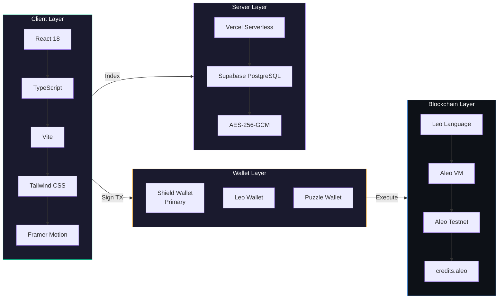

# PrivateSplit — Private Expense Splitting on Aleo

[](https://private-split.vercel.app)
[](https://testnet.explorer.provable.com/program/private_split_v3.aleo)
[](https://app.akindo.io)
[](LICENSE)

> **Split expenses with friends without revealing who owes what, how much, or who paid.**

**Contract:** `private_split_v3.aleo` on Aleo Testnet (v1, v2 also deployed)
**Built for:** Aleo Privacy Buildathon by AKINDO — Wave 2

---

## TL;DR

PrivateSplit is an on-chain expense splitting protocol where **zero financial data is ever public**. No amounts, no addresses, no payment details — only anonymous counters ("a split exists, N people involved, M have paid"). Every amount, every participant, every debt is encrypted using Aleo's zero-knowledge proofs. The `issue_debt` transition has **no finalize block at all** — meaning debt issuance leaves literally zero trace on the blockchain. The `disclose_to_auditor` transition enables **selective disclosure** — prove specific fields to an auditor with zero on-chain trace, using ZK proofs to guarantee authenticity.

---

## Table of Contents

- [The Problem](#the-problem)
- [Privacy Comparison](#privacy-comparison)
- [Privacy Model](#privacy-model)
- [Architecture](#architecture)
- [Split Lifecycle](#split-lifecycle)
- [Smart Contract](#smart-contract-7-transitions-5-records-zero-leaks)
- [Privacy Architecture Diagram](#privacy-architecture)
- [Tech Stack](#tech-stack)
- [How to Test](#how-to-test-wave-2)
- [Project Structure](#project-structure)
- [Backend API](#backend-api)
- [Security & Attack Mitigations](#security--attack-mitigations)
- [Wave 2 Changelog](#wave-2-progress-changelog)
- [Roadmap](#whats-next-wave-3)
- [License](#license)

---

## The Problem

Splitwise stores every expense, every amount, and every participant on their servers. Venmo publishes your payment activity by default. Every time you split a dinner or a trip with friends, a corporation learns your financial relationships, spending habits, and social graph.

**PrivateSplit keeps this data private.** Every amount, every participant, every debt — encrypted on-chain using zero-knowledge proofs. The only public information is an anonymous counter: "a split exists, N people were involved, M have paid."

---

## Privacy Comparison

| Data | Splitwise | Venmo | Other ZK Apps | **PrivateSplit** |
|------|-----------|-------|--------------|-----------------|
| Payment amounts on-chain | N/A | N/A | **Public inputs** | **Never stored** |
| Merchant/recipient address | N/A | N/A | **Public inputs** | **Encrypted in record** |
| Who owes whom | Server | Server | N/A | **Zero on-chain trace** |
| Debt issuance event | Server | Server | On-chain | **No finalize — invisible** |
| Payment metadata | Server | Public | **Public field** | **Not supported (by design)** |
| Settlement event | Server | N/A | Hash visible | Anonymous counter only |

### Key Architecture Decision: `issue_debt` Has No Finalize

In PrivateSplit, when a creator issues a debt to a participant, **there is literally zero on-chain record that this happened**. The `issue_debt` transition has no `finalize` block. This means:

- No mapping is written
- No hash is stored
- No event is emitted
- The blockchain observer sees nothing

The participant's encrypted Debt record appears in their wallet. That is it. No blockchain explorer can determine who owes what to whom.

---

## Privacy Model

| Data | Storage | Visible To |
|------|---------|-----------|
| Total split amount | Split record (encrypted) | Creator only |
| Per-person share | Split + Debt records | Creator + debtor only |
| Who owes whom | Debt record (encrypted) | Debtor + creditor only |
| Payment amounts | Receipt records (encrypted) | Payer + creditor only |
| Payer identity | credits.aleo/transfer_private | Hidden by protocol |
| Split exists | `splits` mapping | Public (anonymous) |
| Number of participants | `splits` mapping | Public (just a count) |
| Number of payments | `splits` mapping | Public (just a count) |
| Settlement status | `splits` mapping | Public (0 or 1) |

**Zero amounts in any public mapping. Zero addresses in any public mapping. Zero private data in any finalize block.**

---

## Architecture



---

## Split Lifecycle



---

## Privacy Architecture

```mermaid
graph LR
    subgraph PUBLIC["🌐 PUBLIC (On-Chain Mappings)"]
        direction TB
        S1["split exists ✓"]
        S2["participant_count: 3"]
        S3["payment_count: 2"]
        S4["status: active"]
        S5["expiry_height: 50000"]
    end

    subgraph PRIVATE["🔒 PRIVATE (Encrypted Records)"]
        direction TB
        R1["Split Record<br/>→ total: 30,000,000 μcredits<br/>→ per_person: 10,000,000<br/>→ creator: aleo1abc..."]
        R2["Debt Record<br/>→ amount: 10,000,000<br/>→ creditor: aleo1abc...<br/>→ debtor: aleo1xyz..."]
        R3["PayerReceipt<br/>→ split_id, amount, creditor"]
        R4["CreatorReceipt<br/>→ split_id, amount, payer"]
    end

    subgraph INVISIBLE["👻 INVISIBLE (No Finalize)"]
        direction TB
        I1["issue_debt transition<br/>→ Zero mappings written<br/>→ Zero events emitted<br/>→ Zero hashes stored"]
    end

    PUBLIC -.-|"Only this is visible<br/>to blockchain observers"| PRIVATE
    PRIVATE -.-|"Encrypted to record owner<br/>Nobody else can decrypt"| INVISIBLE

    style PUBLIC fill:#1e3a2f,stroke:#00C48C,color:#fff
    style PRIVATE fill:#1a1a3e,stroke:#58a6ff,color:#fff
    style INVISIBLE fill:#2d1a1a,stroke:#f87171,color:#fff
```



---

## Smart Contract: 7 Transitions, 5 Records, Zero Leaks

```
program private_split_v3.aleo (deployed on Aleo Testnet)
│
├── Records (ALL private, encrypted to owner)
│   ├── Split             — Creator's record (total, per-person, count, expiry)
│   ├── Debt              — Participant's record (amount owed, to whom)
│   ├── PayerReceipt      — Payer's proof of payment
│   ├── CreatorReceipt    — Creator's proof of receipt
│   └── DisclosureReceipt — Auditor's selective disclosure proof
│
├── Mappings (ONLY anonymous counters, zero private data)
│   ├── splits:      split_id → {participant_count, payment_count, status, expiry_height, token_type}
│   └── split_salts: salt → split_id  (for post-creation lookup)
│
└── Transitions
    ├── create_split(total, count, salt, expiry, token_type) → Split + finalize (stores counters)
    ├── issue_debt(split_record, participant)     → Split + Debt    (NO FINALIZE)
    ├── pay_debt(debt_record, credits_record)     → receipts + finalize (increments counter)
    ├── settle_split(split_record)               → finalize (sets status=1)
    ├── expire_split(split_id)                   → finalize (sets status=2, checks block height)
    ├── verify_split(split_id)                   → finalize (public read)
    └── disclose_to_auditor(split, auditor, mask) → Split + DisclosureReceipt (NO FINALIZE)
```

### Selective Disclosure Audit System

The `disclose_to_auditor` transition allows the creator to selectively reveal specific fields to an auditor:

- **No finalize block** — zero on-chain trace of disclosure
- **Bitmask selection** — choose which of 5 fields to reveal (total_amount, per_person, participant_count, issued_count, token_type)
- **ZK proof guarantee** — Aleo's proof system proves the values came from a real Split record
- **Encrypted receipt** — only the auditor can decrypt the DisclosureReceipt
- **Non-destructive** — Split record is returned to creator (not consumed)

Privacy advantage: 0 public mappings for disclosure (vs 11+ in competitor approaches). Not even the fact that a disclosure happened is visible on-chain.

### Key Design: Only the Record Owner Can Spend It

Aleo's protocol enforces record ownership at the ZK proof level — not application logic. This means:
- Only the creator can issue debts (they own the Split record)
- Only the participant can pay their debt (they own the Debt record)
- Nobody can forge a receipt — ownership is cryptographically verified

### Cryptographic Primitives

| Primitive | Usage | Why |
|-----------|-------|-----|
| **BHP256** | Split ID generation | ZK-circuit optimized hash, native to Aleo (~4x fewer constraints than Poseidon) |
| **Nullifiers** | Double-spend prevention | Automatic at protocol level — reveals nothing about the record |
| **Cryptographic Salt** | Split uniqueness | 128-bit entropy via `crypto.getRandomValues()`, prevents hash collision |
| **AES-256-GCM** | Off-chain metadata | Authenticated encryption for backend storage |

---

## Tech Stack



| Layer | Technology |
|-------|-----------|
| Smart Contract | Leo (Aleo) |
| Blockchain | Aleo Testnet |
| Frontend | React 18 + TypeScript + Vite |
| Styling | Tailwind CSS (glassmorphic dark theme) |
| Typography | Inter (UI) + JetBrains Mono (data) |
| State | Zustand + localStorage |
| Wallet | Shield Wallet (primary), Leo, Puzzle, Fox, Soter |
| Backend | Vercel Serverless Functions + Supabase |
| Database | Supabase PostgreSQL (with in-memory fallback) |
| Encryption | AES-256-GCM |
| Deployment | Vercel |

---

## How to Test (Wave 2)

### Prerequisites
- [Shield Wallet](https://www.leo.app/) browser extension installed
- Aleo Testnet credits (get from [faucet](https://faucet.aleo.org/))

### Step-by-Step

1. **Connect**: Visit https://private-split.vercel.app → Connect Shield Wallet
2. **Create**: Go to Create → Enter description, total amount, participant count + addresses
3. **Issue Debts**: On the split detail page → click "ISSUE" for each participant
4. **Share**: Copy the payment link or scan the QR code
5. **Pay**: Participants follow the payment link → click "EXECUTE PAYMENT"
6. **Verify**: Visit Explorer → paste split ID → see on-chain status (or use Verification page)
7. **Settle**: Creator clicks "SETTLE SPLIT" when all payments received

### Pre-Populated Test Data

The Explorer page auto-loads confirmed on-chain data:
- **Split ID**: `1904758949858929157912240259749859140762221531679669196161601694830550064831field`
- **Salt**: `987654321098765field`
- **TX Hash**: `at1ue3v4t5u9rsmf7h7jnee8dhr6dguda59lrct68j3d4rjhm395vqqhjwcxv`

### Run Tests

```bash
# Frontend unit tests (53 tests)
cd frontend && npm test

# Leo contract tests (12 tests)
cd contracts/private_split_v3 && leo test
```

### Verify with CLI

```bash
# Check split status on-chain
curl https://api.provable.com/v2/testnet/program/private_split_v3.aleo/mapping/splits/{split_id}

# View program on explorer
# https://testnet.explorer.provable.com/program/private_split_v3.aleo
```

---

## Project Structure

```
privatesplit/
├── contracts/
│   ├── private_split/              # v1 contract (deployed)
│   │   ├── src/main.leo            # Leo source code
│   │   ├── program.json            # Program manifest
│   │   ├── build/main.aleo         # Compiled AVM bytecode
│   │   └── tests/test_private_split.leo
│   ├── private_split_v2/           # v2 contract (deployed)
│   │   ├── src/main.leo
│   │   ├── program.json
│   │   └── build/main.aleo
│   └── private_split_v3/           # v3 contract (active) — fixed expiry + token_type
│       ├── src/main.leo            # Leo source — 6 transitions, 4 records
│       ├── program.json
│       └── tests/test_private_split_v3.leo  # 12 contract tests
├── frontend/
│   ├── src/
│   │   ├── App.tsx                 # Router + route definitions
│   │   ├── main.tsx                # Entry point
│   │   ├── index.css               # Global styles + glassmorphism tokens
│   │   ├── pages/
│   │   │   ├── Dashboard.tsx       # Landing page with network stats
│   │   │   ├── CreateSplit.tsx     # Create new split
│   │   │   ├── SplitDetail.tsx     # Split detail + issue debts
│   │   │   ├── PaySplit.tsx        # Pay debt with fee estimate + faucet link
│   │   │   ├── MySplits.tsx        # Personal wallet-filtered dashboard
│   │   │   ├── Explorer.tsx        # On-chain explorer with auto-demo
│   │   │   ├── Verification.tsx    # Receipt scanner + decoder
│   │   │   ├── Privacy.tsx         # Privacy model + cryptographic docs
│   │   │   ├── Vision.tsx          # Project vision
│   │   │   ├── Docs.tsx            # Technical documentation
│   │   │   └── Connect.tsx         # Wallet connection
│   │   ├── hooks/
│   │   │   ├── useCreateSplit.ts   # Split creation flow
│   │   │   ├── useIssueDebt.ts     # Debt issuance with retry loop
│   │   │   ├── usePaySplit.ts      # Payment flow
│   │   │   ├── useSettleSplit.ts   # Settlement with retry loop
│   │   │   ├── useSplitStatus.ts   # Auto-polling on-chain status (30s)
│   │   │   └── WalletProvider.tsx  # Shield Wallet adapter config
│   │   ├── components/
│   │   │   ├── layout/Shell.tsx    # App shell (CommandBar + StatusBar)
│   │   │   ├── layout/CommandBar.tsx
│   │   │   ├── layout/StatusBar.tsx
│   │   │   ├── split/SplitForm.tsx # Create form with categories + expiry
│   │   │   ├── split/SplitCard.tsx
│   │   │   ├── split/SplitParticipants.tsx
│   │   │   ├── OnboardingModal.tsx # 4-step first-visit walkthrough
│   │   │   ├── AnimatedBackground.tsx
│   │   │   ├── ErrorBoundary.tsx
│   │   │   ├── PageTransition.tsx
│   │   │   └── ui/                 # Design system (Card, Button, Badge, etc.)
│   │   ├── services/
│   │   │   ├── api.ts              # Backend API client
│   │   │   └── aleo.ts             # Aleo network service
│   │   ├── utils/
│   │   │   ├── aleo-utils.ts       # Split status, on-chain queries
│   │   │   ├── record-utils.ts     # Record field parsing
│   │   │   ├── format.ts           # Address truncation, credit formatting
│   │   │   └── constants.ts        # Program IDs, fees, endpoints
│   │   ├── store/splitStore.ts     # Zustand state management
│   │   ├── types/split.ts          # TypeScript type definitions
│   │   └── design-system/          # Design tokens + cn utility
│   ├── package.json
│   ├── tailwind.config.js
│   ├── tsconfig.json
│   └── vite.config.ts
├── api/                            # Vercel Serverless Functions
│   ├── splits/index.js             # GET/POST /api/splits
│   ├── splits/[splitId].js         # GET/PATCH /api/splits/:id
│   ├── splits/recent.js            # GET /api/splits/recent
│   ├── splits/creator/[address].js # GET /api/splits/creator/:addr
│   ├── receipt/[splitId]/[type].js # GET /api/receipt/:id/:type
│   ├── stats.js                    # GET /api/stats (network stats)
│   ├── health.js                   # GET /api/health
│   ├── _store.js                   # In-memory store + demo data
│   └── _supabase.js                # Supabase client + AES-256-GCM
├── vercel.json                     # Deployment config + COOP/COEP headers
├── README.md
└── CHANGELOG.md
```

---

## Backend API

**Base URL:** `https://private-split.vercel.app/api`

| Endpoint | Method | Description |
|----------|--------|-------------|
| `/api/splits` | GET | List all splits (with filters) |
| `/api/splits` | POST | Create split record (encrypted) |
| `/api/splits/:id` | GET | Get single split by ID |
| `/api/splits/:id` | PATCH | Update split (payment, status) |
| `/api/splits/recent` | GET | Recent splits for explorer |
| `/api/splits/creator/:address` | GET | Splits by creator address |
| `/api/receipt/:splitId/:type` | GET | Export receipt (payer/creator) |
| `/api/stats` | GET | Network-wide statistics |
| `/api/health` | GET | Service health + version |

All sensitive fields (addresses, amounts) are encrypted with **AES-256-GCM** before storage. When `SUPABASE_URL` and `SUPABASE_KEY` env vars are set, data persists in Supabase PostgreSQL. Without them, an in-memory store with demo data is used as fallback.

---

## Security & Attack Mitigations

### On-Chain Privacy Guarantees

| Protection | How |
|-----------|-----|
| **No private data in finalize** | All finalize blocks only write anonymous counters — verified |
| **No private data in mappings** | Mappings contain `{participant_count, payment_count, status, expiry_height}` — zero amounts, zero addresses |
| **Record ownership** | Enforced by Aleo protocol at ZK proof level — not application logic |
| **Nullifiers** | Prevent double-spending automatically — reveal nothing about the record |
| **Payer anonymity** | Payments via `credits.aleo/transfer_private` — payer identity hidden by protocol |

### Attack Mitigations

| Attack | Mitigation |
|--------|-----------|
| **Double payment** | Debt record is consumed on payment — cannot be spent twice (nullifier) |
| **Receipt forgery** | Only the Aleo VM can create receipts during `pay_debt` — records are cryptographically signed |
| **Unauthorized settlement** | Only the Split record owner can call `settle_split` — protocol-enforced |
| **Unauthorized debt issuance** | Only the Split record owner can call `issue_debt` — protocol-enforced |
| **Expired split payment** | `pay_debt` finalize checks `block.height < expiry_height` — enforced on-chain |
| **Split ID collision** | 128-bit cryptographic salt + BHP256 hash — collision probability ~2^-128 |
| **Backend data leak** | All addresses/amounts encrypted with AES-256-GCM + random IVs before storage |
| **Cross-origin attack** | COOP/COEP headers isolate WASM execution — prevents cross-origin data access |
| **Replay attack** | Each debt record has a unique split_id + participant address binding — cannot be reused |

### Off-Chain Security
- Cryptographically secure random salt: `crypto.getRandomValues(new Uint8Array(16))`
- AES-256-GCM with random IVs for all off-chain encrypted data
- COOP/COEP headers prevent cross-origin data leaks
- HTTPS enforced in production

---

## Wave 2 Progress Changelog

### New in Wave 2 (Feb 11–25, 2026)

**Smart Contract v3 (`private_split_v3.aleo`)**
- Fixed expiry system: absolute block height computed in finalize using `block.height + (expiry_hours * 360)`
- Added `token_type` field (u8) to SplitMeta and Split record for multi-token readiness
- 6 transitions, 4 record types, 2 mappings — zero private data in any mapping
- `issue_debt` transition with NO finalize block — zero on-chain trace
- Cryptographic settlement: only record owner can settle (protocol-enforced)
- `expire_split` transition — anyone can expire a split past its deadline
- Expiry enforcement in `pay_debt` finalize — payments rejected after expiry
- 12 Leo contract tests covering all core logic
- 53 Vitest frontend tests for utility functions

**Shield Wallet Integration (Wave 2 Mandatory)**
- Full Shield Wallet support via `@provablehq/aleo-wallet-adaptor-react`
- Real `credits.aleo/transfer_private` payments (not mocked)
- Automatic `transfer_public_to_private` fallback when no private records found
- Candidate retry loop for opaque wallet records (tries each candidate until accepted)
- 4-strategy split_id retrieval after transaction finalization

**Privacy Architecture**
- Cryptographically secure salt via `crypto.getRandomValues()` (not `Math.random()`)
- Backend encrypts all sensitive fields (addresses + amounts) with AES-256-GCM
- COOP/COEP headers for WASM isolation (required for Aleo SDK)
- Zero private data in any finalize scope
- Trust model documentation — explains exactly what you trust at each layer

**Frontend Overhaul**
- Full UI redesign: glassmorphic dark fintech aesthetic with Inter + JetBrains Mono
- 8 expense categories (Dinner, Groceries, Rent, Travel, Utilities, Entertainment, Shopping, Other)
- Split expiry selection (1h, 24h, 3d, 7d, 30d, or no expiry)
- My Splits dashboard with activity chart, category breakdown, stat cards
- Enhanced Explorer with auto-loaded demo data, network stats
- Receipt verification: scan wallet for PayerReceipt/CreatorReceipt, decode fields
- 4-step onboarding walkthrough for first-time visitors
- Fee estimates before payment with faucet link on insufficient balance
- Enhanced payment success screen with TX explorer link
- QR code generation for payment link sharing
- Auto-polling: creator sees payment updates every 30 seconds
- 11 functional pages, responsive mobile layout

**Backend v2**
- Vercel Serverless Functions with Supabase PostgreSQL (in-memory fallback)
- AES-256-GCM encrypted storage for all sensitive fields
- REST API: splits, stats, receipts, cross-device recovery
- Category, expiry, and token type support

---

## What's Next (Wave 3+)

- USDCx stablecoin payments via `token_registry.aleo` (UI toggle ready)
- Group expense templates (recurring splits with saved participant lists)
- Merchant dashboard with earnings analytics
- Treasury management for organizations
- Mobile app (React Native / Expo)
- Multi-payment invoices (pay partial amounts)
- Dispute resolution system with on-chain evidence

---

## Environment Setup

### Frontend

```bash
cd frontend
npm install
npm run dev          # Development server at localhost:5173
npm run build        # Production build
```

### Backend (Local)

```bash
cd backend
npm install
npm start            # Express server at localhost:3001
```

### Environment Variables

**Frontend** (`.env` in `frontend/`):
```env
VITE_PROGRAM_ID=private_split_v3.aleo
VITE_BACKEND_URL=https://private-split.vercel.app
```

**Backend** (Vercel environment or `.env`):
```env
SUPABASE_URL=your_supabase_url
SUPABASE_KEY=your_supabase_anon_key
ENCRYPTION_KEY=your_64_char_hex_key
```

**Generate an encryption key:**
```bash
node -e "console.log(require('crypto').randomBytes(32).toString('hex'))"
```

### Smart Contract (Leo CLI)

```bash
cd contracts/private_split_v3
leo build            # Compile to AVM bytecode
leo deploy --network testnet
```

---

## Documentation

- [Architecture](docs/ARCHITECTURE.md) — System overview, data flows, component breakdown
- [Privacy Model](docs/PRIVACY_MODEL.md) — What's private, what's public, security properties
- [Changelog](CHANGELOG.md) — Wave-by-wave progress log

---

## License

MIT
